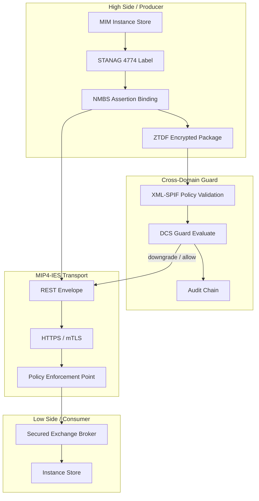

# AINextGenC2 NATO/STANAG System Architecture

This document describes **what the MIM stack does** from a NATO information-exchange and data-centric security perspective.

## Purpose

AINextGenC2 implements a **MIP Information Model (MIM) exchange stack** with NATO-standard confidentiality labeling, metadata binding, cross-domain guard, and MIP4-IES transport. It enables coalition C2 systems to:

1. **Publish and consume** MIM instances (tracks, targets, units, etc.) over a REST API aligned with MIP4-IES.
2. **Label every object** with STANAG 4774 confidentiality metadata (classification, releasability, policy).
3. **Cryptographically bind** labels to payloads using STANAG 4778 NMBS (RSA-PSS-SHA256) assertion bindings.
4. **Package encrypted releases** as ZTDF archives for cross-domain transfer.
5. **Enforce guard decisions** when data moves between security domains (high side → low side, coalition partners).
6. **Record auditable decisions** for guard, PEP, and binding verification events.

## Logical architecture



## Major subsystems

### MIM semantic layer (`mim-core`, `mim-model`, `mim-runtime`)

Loads the MIM 5.1 manifest, validates instances against the taxonomy, assigns OIDs, and serializes exchanges to JSON/XML. This is the semantic foundation — all labeling and transport wrap MIM instances.

### Confidentiality labeling (`mim-labeling`, `mim-stanag4774`)

Represents **ConfidentialityLabel** objects independent of wire format. The STANAG 4774 codec serializes/deserializes XML and JSON-structured labels. National policy profiles include NATO, US CAPCO (demo SPIF), and UK DEMO (demo SPIF).

### Metadata binding (`mim-stanag4778`, `mim-crypto`)

Implements ADatP-4778 binding profiles:

| Profile | Use case |
|---------|----------|
| Embedded / XML embedded / encapsulated / detached | In-domain metadata association with digest integrity |
| **Assertion (NMBS)** | Cross-domain and ZTDF — RSA-PSS-SHA256 over label XML + payload digest |
| REST envelope | MIP4-IES HTTP PUT with `X-NATO-Confidentiality-Label` header |
| SMTP header | Email gateway binding profile |

Cross-domain release **requires** assertion binding; embedded-only bindings are rejected at the guard.

### ZTDF packaging (`mim-ztdf`)

Produces OpenTDF-style ZIP archives:

- `manifest.json` — STANAG 4774 label assertion, AES-256-GCM parameters, RSA-OAEP wrapped CEK
- `0.payload` — AES-256-GCM encrypted MIM JSON

The manifest stores the exact signed label XML bytes to preserve NMBS verification across round-trips.

### Data-centric security (`mim-dcs`, `mim-policy`)

**CrossDomainGuard** evaluates labels against source/target **SecurityDomain** definitions using an XACML-style policy plane (PIP → PDP → PEP). Decisions: **Allow**, **Downgrade**, or **Deny**.

**CrossDomainTransfer** pipeline:

1. Verify inbound NMBS assertion binding
2. Evaluate guard (SPIF-validated label)
3. On allow/downgrade: emit downgraded label XML, outbound NMBS binding, ZTDF package
4. Append audit records (hash-chained, optionally NMBS-signed)

SPIF policies can be loaded into the **Policy Administration Point (PAP)** to drive domain releasability constraints.

### SPIF policy (`mim-spif`)

Ingests XML-SPIF documents (NATO, ACME conformance, CAPCO-US demo, UK DEMO demo). Validates labels against allowed classifications, categories, and validation rules at bind time and guard evaluation.

### Transport (`mim-transport`, `mim-transport-http`)

**MIP4-IES REST** service interface:

- `PUT /mip4-ies/v1/objects` — publish instance (STANAG 4778 REST envelope)
- `GET /mip4-ies/v1/objects/{oid}` — retrieve by OID
- `GET /mip4-ies/v1/objects` — filter by class/property
- `DELETE /mip4-ies/v1/objects/{oid}` — soft delete

The **SecuredExchangeBroker** wraps the broker with PEP clearance checks. The HTTP server verifies REST envelopes against a configurable **NMBTrustStore** (production PKI) before accepting objects.

### Audit (`mim-audit`)

Append-only audit log with:

- Hash chain (`GENESIS` → record₁ → record₂ → …)
- Optional NMBS signatures over each envelope
- SIEM-oriented JSON export

### Import (`mim-import`)

Fetches JC3IEDM/MIM OWL from **mimworld.org** or local files and merges into the workspace manifest for authoritative MIM semantics.

## Typical operational flows

### In-domain labeled publish

1. Operator creates a MIM instance with security metadata.
2. System builds a STANAG 4774 label and NMBS assertion binding.
3. REST envelope wraps the instance; HTTPS delivers to the exchange broker.
4. PEP verifies operator clearance ≥ object classification.

### Cross-domain release (high → low)

1. Producer submits labeled MIM JSON with inbound NMBS binding.
2. Guard validates SPIF policy and releasability against target domain.
3. On downgrade: effective label reduced (e.g. SECRET → RESTRICTED).
4. Outbound NMBS binding + ZTDF ZIP produced; audit chain extended.
5. Low-side consumer decrypts ZTDF, verifies binding, ingests MIM JSON.

## Compliance verification

Run automated NATO ADatP and labeling compliance suites:

```bash
cargo test -p mim-adatp-conformance
cargo test -p mim-labeling-compliance
cargo test -p ainextgenc2
```

Exit code 0 on `cargo run -p ainextgenc2 -- --labeling` indicates full labeling compliance across 12 dimensions.

## Deployment tiers

| Tier | Supported today |
|------|-----------------|
| Development / lab | Full stack with conformance keys |
| Coalition exercise | PKI-backed NMBTrustStore, TLS, SPIF-administered guard |
| Classified accredited | Requires FIPS-validated crypto module build, WORM audit storage, formal guard accreditation (see technology doc) |

See [NATO-STANAG-TECHNOLOGY.md](./NATO-STANAG-TECHNOLOGY.md) for implementation and technology choices.
