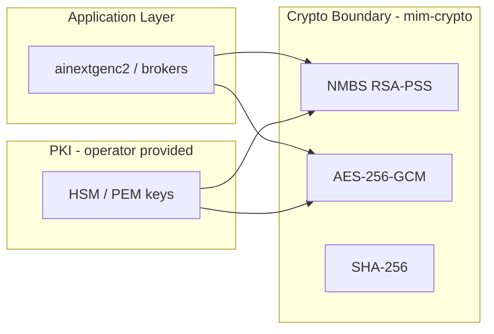

# AINextGenC2 NATO/STANAG Technology Reference

This document describes **how the stack implements** NATO/STANAG requirements — crates, algorithms, protocols, and build options.

## Crate map

| Crate | Technology role |
|-------|-----------------|
| `mim-crypto` | Cryptographic boundary — NMBS, ZTDF encryption, PKI loading |
| `mim-spif` | XML-SPIF parser and label validator |
| `mim-stanag4774` | STANAG 4774 label codec (XML + JSON-structured) |
| `mim-stanag4778` | STANAG 4778 binding profiles + REST/SMTP envelopes |
| `mim-ztdf` | ZTDF ZIP packaging (AES-256-GCM + manifest) |
| `mim-audit` | Hash-chained, NMBS-signable audit envelopes |
| `mim-policy` | XACML-style PIP/PAP/PDP/PEP + SPIF administration |
| `mim-dcs` | Cross-domain guard and transfer orchestration |
| `mim-transport` | MIP4-IES REST broker + STANAG 4778 envelope helpers |
| `mim-transport-http` | Axum + rustls HTTPS/mTLS server |
| `mim-import` | mimworld.org OWL fetch + manifest import |
| `mim-labeling-compliance` | 12-dimension automated compliance checker |
| `mim-adatp-conformance` | NATO ADatP test vector runner |

## Cryptography (`mim-crypto`)

### Algorithms

| Function | Algorithm | Standard |
|----------|-----------|----------|
| NMBS binding sign/verify | RSA-PSS with SHA-256 | ADatP-4778 NMBS |
| Payload / metadata digest | SHA-256 (Base64) | STANAG 4778 integrity |
| ZTDF payload encryption | AES-256-GCM | OpenTDF / ACP-240 |
| ZTDF key wrap | RSA-OAEP with SHA-256 | OpenTDF split encryption |

### NMBS message format

Signing canonicalizes as:

```
message = UTF-8(label_xml) || 0x7C || ASCII(payload_digest_base64)
signature = RSA-PSS-SHA256(message)
```

Assertion bindings store `signed_label_xml` — the exact bytes signed — to survive JSON/ZTDF manifest round-trips without XML re-serialization drift.

### Provider backends

| Feature flag | Backend | AES-GCM / SHA-256 | RSA (NMBS/KAS) |
|--------------|---------|-------------------|----------------|
| `ring-backend` (default) | `ring` + `rsa` crate | ring | rsa crate |
| `fips` | `aws-lc-rs` (non-FIPS build) | AWS-LC | rsa crate |
| `fips-validated` | `aws-lc-rs/fips` | FIPS 140-3 module | rsa crate* |

\* RSA key operations remain in the `rsa` Rust crate outside the FIPS module boundary. For accredited deployments, place RSA operations in an approved HSM/KMS and supply keys via PKCS#8/SPKI through the PKI API below.

Build examples:

```bash
# Default (development)
cargo build -p mim-crypto

# AWS-LC module (AES/SHA inside AWS-LC)
cargo build -p mim-crypto --features fips

# FIPS 140-3 validated module (requires Rust ≥ 1.85, native AWS-LC FIPS build)
cargo build -p mim-crypto --features fips-validated
```

### Production PKI

```rust
use mim_crypto::{NmbKeyRing, NmbTrustStore};

// Load operator NMBS + KAS keys from PKCS#8 PEM
let ring = NmbKeyRing::from_pkcs8_files(
    "/etc/mim/nmb-signing.pk8",
    "/etc/mim/kas-signing.pk8",
    "nmb-prod-1",
    "kas-prod-1",
)?;

// Load coalition verifying keys from SPKI PEM
let trust = NmbTrustStore::from_spki_pem_files(["/etc/mim/nmb-trust.pem"])?;
```

Lab/conformance mode uses `NmbKeyRing::conformance()` and the fixture at `crates/mim-crypto/fixtures/nmb-conformance-rsa.pk8`.

## SPIF (`mim-spif`)

- **Parser:** `quick-xml` streaming parser for XML-SPIF policy documents
- **Policies shipped:** NATO 4774 reference, ACME ADatP-4774.1, CAPCO-US demo, UK DEMO demo
- **Validation:** classification allow-list, category value constraints, SPIF validation rules (e.g. ACME CONFIDENTIAL requires Releasable To MOCK/PHONY)

SPIF integrates with policy administration:

```rust
use mim_policy::PolicyAdministrationPoint;
use mim_spif::SpifRegistry;

let pap = PolicyAdministrationPoint::with_spif_registry(SpifRegistry::with_defaults())?;
// Domain releasability in PRP now reflects SPIF "Releasable To" categories
```

Cross-domain guard from SPIF:

```rust
use mim_dcs::CrossDomainGuard;

let guard = CrossDomainGuard::from_spif_registry(SpifRegistry::with_defaults())?;
```

## STANAG 4778 binding profiles (`mim-stanag4778`)

Implemented in Rust with `serde` JSON serialization:

- **Digest integrity:** SHA-256 over payload bytes on all profiles
- **Assertion profiles:** delegate to `mim-crypto::sign_nmb_binding` / `verify_nmb_binding`
- **SPIF gate:** `SpifValidator::validate_label` at assertion bind time

REST envelope fields (`RestEnvelope`):

| Field | Content |
|-------|---------|
| `originatorConfidentialityLabel` | STANAG 4774 XML |
| `payloadDigest` | SHA-256 Base64 of payload |
| `payload` | MIM JSON string |
| `assertion` | NMBS `AssertionBinding` |

HTTP header `X-NATO-Confidentiality-Label` must match `originatorConfidentialityLabel`.

## ZTDF (`mim-ztdf`)

ZIP layout:

```
manifest.json   # tdf_spec_version 1.0.0, encryption_information, assertions[]
0.payload       # IV || ciphertext || tag (AES-256-GCM)
```

Manifest assertion `nato-label-1` carries JSON-structured STANAG 4774 label plus `signedLabelXml` for NMBS verification. CEK is wrapped with KAS public key (RSA-OAEP-SHA256).

## Audit trail (`mim-audit`)

Each record is wrapped in an `AuditEnvelope`:

| Field | Purpose |
|-------|---------|
| `previousHash` | Chain link (starts at `GENESIS`) |
| `recordHash` | SHA-256(`previousHash \| JSON(record)`) |
| `signature` | Optional NMBS over `audit-record \| recordHash` |

```rust
use mim_audit::AuditLog;

let audit = AuditLog::memory().with_signing_key(nmb_signing_key);
audit.record(record)?;
audit.verify_chain()?;
let siem = audit.export_siem()?;
```

File sink writes append-only JSON lines via `FileAuditSink::open(path)`.

## MIP4-IES transport

### REST routes (`mim-transport::rest`)

| Method | Path | Operation |
|--------|------|-----------|
| PUT | `/mip4-ies/v1/objects` | PutObject |
| GET | `/mip4-ies/v1/objects/{oid}` | GetByOID |
| GET | `/mip4-ies/v1/objects` | GetByFilter |
| DELETE | `/mip4-ies/v1/objects/{oid}` | DeleteObject |

### Envelope helpers (`mim-transport::envelope`)

```rust
use mim_transport::envelope::{wrap_put_object, unwrap_put_object};

let envelope = wrap_put_object(&label, &put_request, &nmb_signing_key)?;
let request = unwrap_put_object(&envelope, &nmb_verifying_key)?;
```

### HTTPS server (`mim-transport-http`)

| Component | Library |
|-----------|---------|
| HTTP framework | Axum 0.7 |
| TLS | rustls 0.22 + tokio-rustls |
| PEM parsing | rustls-pemfile |

Configuration:

```rust
use mim_transport_http::{HttpExchangeConfig, HttpExchangeServer};

let config = HttpExchangeConfig {
    trust_store: NmbTrustStore::from_spki_pem_files(["/etc/mim/trust.pem"])?,
};
let server = HttpExchangeServer::new(addr, tls_identity)
    .with_config(config)
    .with_client_ca(include_bytes!("/etc/mim/client-ca.pem"))?; // optional mTLS
```

The server selects the verifying key by NMBS `keyId` from the REST envelope assertion — not a hardcoded conformance key.

## Policy plane (`mim-policy`)

XACML-inspired separation:

| Component | Rust type | Responsibility |
|-----------|-----------|----------------|
| PIP | `PolicyInformationPoint` | Assemble subject/resource/environment context |
| PRP | `PolicyStore` | Store domains, cross-domain rules, SPIF policies |
| PAP | `PolicyAdministrationPoint` | Author/register policies and SPIF XML |
| PDP | `PolicyDecisionPoint` | Evaluate permit/deny/downgrade |
| PEP | `PolicyEnforcementPoint` | Enforce at transport/DCS boundary; optional audit |

PEP audit integration:

```rust
use mim_audit::AuditLog;
use mim_policy::PolicyEnforcementPoint;

let pep = PolicyEnforcementPoint::from_preset_high_to_low()
    .with_audit(AuditLog::memory());
```

## MIM import (`mim-import`)

```bash
# Authoritative mimworld JC3IEDM
cargo run -p mim-import -- --source mimworld \
  --output models/mim-full-5.1.json --merge models/mim-core-5.1.json

# Local OWL file
cargo run -p mim-import -- --owl /path/to/JC3IEDM.owl --output models/mim-full-5.1.json
```

HTTP fetch uses `ureq` with TLS. Set `authoritative_mimworld` to skip synthetic OWL padding.

## Language and quality constraints

- **Rust edition 2021**, MSRV 1.75 (workspace); `fips-validated` may require newer toolchain
- **Zero-panic policy:** `#![deny(clippy::unwrap_used, ...)]`, `#![forbid(unsafe_code)]`
- **Serialization:** `serde` + `serde_json` throughout wire formats
- **XML:** `quick-xml` for STANAG 4774 XML and SPIF

## Security boundaries



## Testing matrix

| Suite | Command | Coverage |
|-------|---------|----------|
| ADatP conformance | `cargo test -p mim-adatp-conformance` | 4774 Table 17, Annex B, 4774.1 ACME, 4778, SPIF, ZTDF |
| Labeling compliance | `cargo test -p mim-labeling-compliance` | 12 dimensions |
| DCS scenario | `cargo test -p ainextgenc2 dcs_scenario` | End-to-end downgrade + ZTDF |
| HTTP envelope | `cargo test -p mim-transport-http handle_put` | Trust store verification |
| Crypto / PKI | `cargo test -p mim-crypto` | NMBS round-trip, PKI load |
| Audit chain | `cargo test -p mim-audit` | Chain + signature |
| SPIF admin | `cargo test -p mim-policy spif` | PAP + guard domains |

## Related documents

- [NATO-STANAG-SYSTEM.md](./NATO-STANAG-SYSTEM.md) — system-level architecture and flows
- [../README.md](../README.md) — workspace overview and quick start
